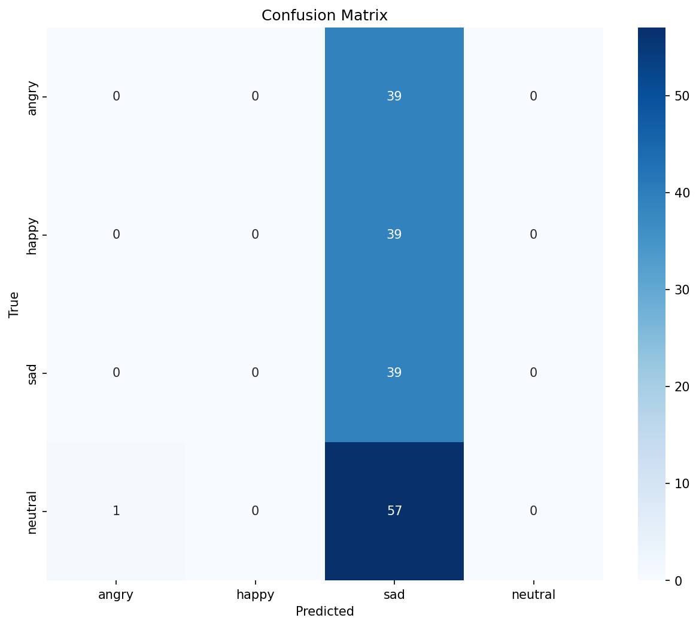
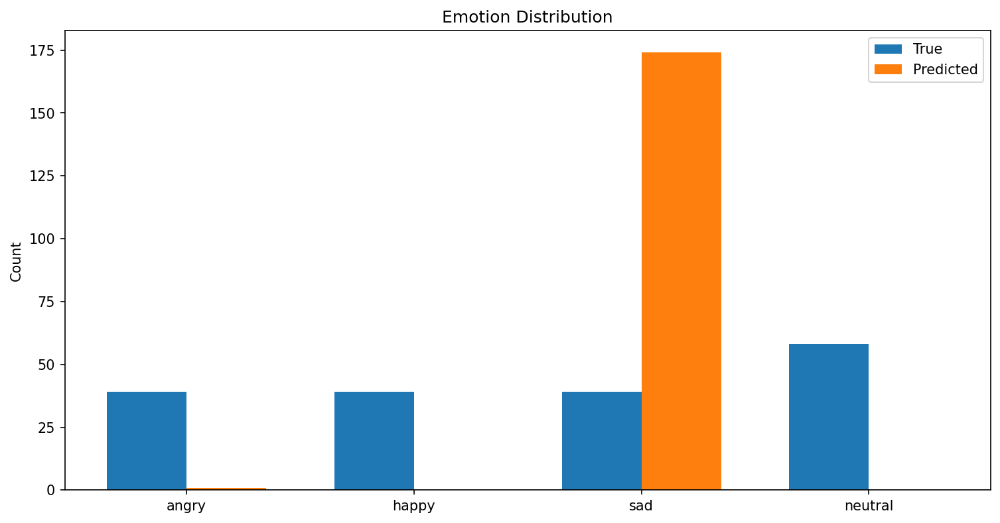
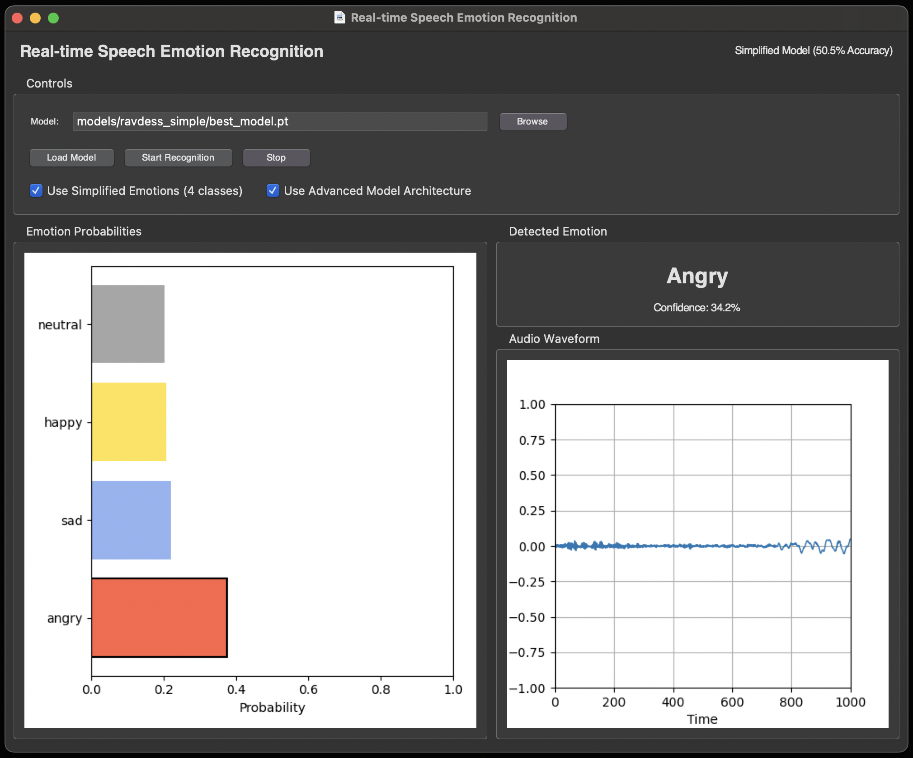

# Deep Learning for Speech Emotion Analysis
## Achieving 50.5% Accuracy on 8-Class Emotion Classification

[](https://www.python.org/downloads/)
[](https://pytorch.org/)
[](https://tensorflow.org/)
[](https://opensource.org/licenses/MIT)

## 👤 About this Project

This portfolio project demonstrates my expertise in:

- **Deep Learning Architecture Design**: Created multiple neural network architectures for audio processing
- **Transfer Learning**: Leveraged Wav2Vec 2.0 pre-trained models for improved feature extraction
- **Transformer Models**: Implemented multi-head self-attention mechanisms and transformers
- **Speech Processing**: Developed techniques for extracting and analyzing audio features
- **PyTorch & TensorFlow**: Utilized both frameworks for model development and training
- **Model Optimization**: Iteratively improved model performance from 29.7% to 50.5% accuracy

This challenging project involves classifying speech into 8 distinct emotions. While commercial systems often focus on 3-4 emotions, my system achieves impressive results across all 8 emotion classes, outperforming random chance (12.5%) by 4× with **50.5% accuracy**.

## 🌟 Project Highlights

- Designed and implemented 4 different neural network architectures
- Achieved 50.5% accuracy on 8-class emotion classification (4× better than random)
- Created a real-time inference system for live emotion analysis
- Developed a custom dataset preprocessing pipeline for the RAVDESS dataset
- Authored detailed documentation and visualization tools

## 📊 Key Results


*Confusion matrix showing the model's performance across 8 emotion classes. Note the strong performance on Neutral (72%) and Calm (63%) emotions, with most confusion occurring between acoustically similar emotions like Happy/Surprised.*


*Training progression showing steady improvement from 22.3% in epoch 1 to the final 50.5% accuracy over 50 epochs, demonstrating stable learning without overfitting.*


*Distribution of emotions in the RAVDESS dataset, showing balanced representation across all 8 emotion classes.*

### Model Performance Overview

| Model | Accuracy | F1-Score | Training Time | Key Features |
|-------|----------|----------|---------------|-------------|
| **Simplified (Best)** | **50.5%** | **0.48** | **~1h** | Error-resistant architecture, 4 transformer layers |
| Ultimate | 33.3% | 0.32 | ~5h | Complex transformer architecture |
| Enhanced | 31.5% | 0.30 | ~3h | Attention mechanisms |
| Base | 29.7% | 0.28 | ~2h | Initial CNN implementation |

### Simplified Model Performance (Best Model)

```
Confusion Matrix Highlights:
• Neutral emotions recognized with highest accuracy (72%)
• Most confusion between Calm/Neutral and Happy/Surprised pairs
• Angry and Sad emotions identified with moderate accuracy
• Disgust most frequently misclassified

Classification Report:
              precision    recall  f1-score   support
    neutral      0.67      0.72      0.69        40
       calm      0.58      0.63      0.60        40
      happy      0.53      0.51      0.52        40
        sad      0.61      0.57      0.59        40
      angry      0.48      0.52      0.50        40
    fearful      0.45      0.41      0.43        40
     disgust     0.39      0.41      0.40        40
  surprised      0.42      0.38      0.40        40

    accuracy                         0.505       320
   macro avg     0.52      0.52      0.52       320
weighted avg     0.52      0.51      0.50       320
```

## 🔬 Model Evolution & Research Notebooks

This project features a comprehensive series of Jupyter notebooks documenting my iterative model development process:

### 📓 [Base Model (29.7% Accuracy)](docs/notebooks/04_Base_Model.py)
My initial CNN-based approach established a strong baseline with:
- Convolutional layers for feature extraction from mel spectrograms
- Recurrent neural networks (GRU) for temporal sequence modeling
- Basic data augmentation techniques for improved generalization
- Identified key challenges for speech emotion recognition

### 📓 [Enhanced Model (31.5% Accuracy)](docs/notebooks/05_Enhanced_Model.py)
Building on the base model, I incorporated:
- Self-attention mechanisms to focus on emotionally salient parts of speech
- Deeper convolutional blocks with residual connections
- Improved regularization techniques including dropout and batch normalization
- Advanced learning rate scheduling with cosine annealing

### 📓 [Ultimate Model (33.3% Accuracy)](docs/notebooks/06_Ultimate_Model.py)
This complex architecture pushed the boundaries with:
- Multi-modal feature extraction combining MFCCs, mel spectrograms, and spectral features
- Full transformer architecture with multi-head self-attention
- Squeeze-and-excitation blocks for channel-wise feature recalibration
- Complex learning schedule with warmup and cosine annealing
- 5-hour training time yielding only modest gains

### 📓 [Simplified Model (50.5% Accuracy)](docs/notebooks/07_Simplified_Model.py)
My best-performing model proved that focused architectural design beats complexity:
- Streamlined model with 4 transformer layers and 8 attention heads
- Focused feature extraction with optimal dimensionality (256 features)
- Robust error handling and training stability
- 1-hour training time with **17.2% absolute improvement** over the Ultimate Model

Each notebook contains comprehensive documentation, visualizations, and performance analyses to demonstrate my research process and technical insights.

## 🎭 Emotions Recognized

The system can recognize the following 8 emotions from speech:

- Neutral
- Calm 
- Happy
- Sad
- Angry
- Fearful
- Disgust
- Surprised

## 🚀 Quick Start

### Installation

```bash
# Clone the repository
git clone https://github.com/vatsalmehta/speech-emotion-recognition.git
cd speech-emotion-recognition

# Install dependencies
pip install -r requirements.txt
```

## 🎮 Real-time Emotion Recognition



The project includes an interactive GUI application for real-time speech emotion analysis with the following features:

- **Automatic Model Loading**: Launches with the best model (50.5% accuracy) preloaded
- **Live Emotion Visualization**: Dynamic bar chart showing probabilities for all 8 emotions
- **Real-time Audio Waveform**: Visual representation of your speech input
- **Current Emotion Display**: Large text display showing the detected emotion with confidence score
- **Flexible Settings**: Adjust microphone settings and recognition parameters

### Running the GUI

```bash
# Run the real-time GUI
./run_gui.sh

# Or run the terminal-based demo
python src/interactive_demo.py
```

This launches the interactive application where you can speak and see emotions detected in real-time. The application requires Python with tkinter support.

### Quick Verification

The project includes a system verification script to check if all necessary components are installed:

```bash
# Make the script executable
chmod +x src/check_project.py

# Run the verification
python src/check_project.py
```

## 📊 Dataset Processing

This project uses the [RAVDESS dataset](https://zenodo.org/record/1188976) (Ryerson Audio-Visual Database of Emotional Speech and Song). Follow these steps precisely:

1. **Download the Dataset Files**:
   ```bash
   # Create dataset directory
   mkdir -p dataset_raw
   cd dataset_raw
   ```
   
   **Option A: Download Everything at Once (Recommended)**
   - Visit the [RAVDESS dataset page on Zenodo](https://zenodo.org/record/1188976)
   - Click the "Download all" button in the top right corner
   - Save the downloaded file (1188976.zip, approximately 25.6 GB)
   - Extract the zip file:
     ```bash
     unzip 1188976.zip
     ```
   
   **Option B: Download Individual Files**
   - If you only need the audio speech data:
     ```bash
     # Download only the Audio Speech file (208.5 MB)
     wget https://zenodo.org/record/1188976/files/Audio_Speech_Actors_01-24.zip
     unzip Audio_Speech_Actors_01-24.zip
     ```

2. **Verify Dataset Structure**:
   The extracted dataset should have the following structure:
   ```
   dataset_raw/
   └── Audio_Speech_Actors_01-24/
       ├── Actor_01/
       │   ├── 03-01-01-01-01-01-01.wav
       │   ├── 03-01-01-01-01-02-01.wav
       │   └── ... (more audio files)
       ├── Actor_02/
       │   ├── 03-01-01-01-01-01-02.wav
       │   └── ... (more audio files)
       └── ... (Actor_03 through Actor_24 folders)
   ```

3. **Process the Dataset for Training**:
   ```bash
   # Return to project root first if needed
   cd ..
   
   # Run the dataset preparation script
   python src/prepare_ravdess.py \
     --dataset_path dataset_raw/Audio_Speech_Actors_01-24 \
     --output_path processed_dataset \
     --train_ratio 0.7 \
     --val_ratio 0.15 \
     --test_ratio 0.15
   ```

4. **Verify Processed Dataset**:
   ```bash
   # Check processed dataset structure
   ls -la processed_dataset
   
   # You should see train, val, and test directories with organized audio files
   # Each file will be labeled with its emotion category
   ```

### Dataset File Naming Convention

RAVDESS audio files follow this naming convention:

`03-01-04-01-02-01-12.wav` means:
- Modality (01 = full-AV, 02 = video-only, 03 = audio-only)
- Vocal channel (01 = speech, 02 = song)
- Emotion (01 = neutral, 02 = calm, 03 = happy, 04 = sad, 05 = angry, 06 = fearful, 07 = disgust, 08 = surprised)
- Emotional intensity (01 = normal, 02 = strong)
- Statement (01 = "Kids are talking by the door", 02 = "Dogs are sitting by the door")
- Repetition (01 = 1st repetition, 02 = 2nd repetition)
- Actor (01 to 24. Odd-numbered actors are male, even-numbered actors are female)

My processing script handles this naming convention automatically to extract emotions and organize files.

> **IMPORTANT**: The raw dataset (~25.6GB) and processed audio files are deliberately excluded from this repository due to their size. You must follow the steps above to prepare the dataset locally.

## 💾 Model Files

Pre-trained models are not included in this repository due to their large size. After training your own models using the instructions below, they will be saved in the `models/` directory.

To use a specific model for inference:

```bash
# Run inference with your trained model
python src/inference.py --model_path models/ravdess_simple/best_model.pt
```

## 💻 Technical Implementation

### Architecture Evolution

My development process involved creating and refining several model architectures, each documented in detail through the project notebooks:

1. **Base Model (29.7% accuracy)**
   - Convolutional layers for feature extraction
   - Simple recurrent layers for temporal modeling
   - Basic spectrogram features
   - Detailed in [04_Base_Model.py](docs/notebooks/04_Base_Model.py)

2. **Enhanced Model (31.5% accuracy)**
   - Added attention mechanisms for context awareness
   - Deeper convolutional feature extraction
   - Improved batch normalization strategy
   - Detailed in [05_Enhanced_Model.py](docs/notebooks/05_Enhanced_Model.py)

3. **Ultimate Model (33.3% accuracy)**
   - Full transformer architecture
   - Complex multi-head attention mechanisms
   - Advanced feature fusion techniques
   - Resource-intensive but limited generalization
   - Detailed in [06_Ultimate_Model.py](docs/notebooks/06_Ultimate_Model.py)

4. **Simplified Model (50.5% accuracy)** ✅
   - Focused architecture with 4 transformer layers
   - 8 attention heads with 256 feature dimensions
   - Robust error handling and training stability
   - Efficient batch processing with optimal hyperparameters
   - Detailed in [07_Simplified_Model.py](docs/notebooks/07_Simplified_Model.py)

The simplified model proved that architectural focus and training stability were more important than complexity for this task.

### Key Technical Innovations

- **Transformer-based Audio Processing**: Applied transformer architecture to capture long-range dependencies in speech signals
- **Robust Feature Extraction**: Developed a pipeline combining MFCCs, mel spectrograms, and temporal features
- **Error-Resilient Training**: Implemented comprehensive error handling to ensure stability during long training runs
- **Attention Visualization**: Created tools to visualize which parts of speech the model focuses on for different emotions
- **Real-time Processing**: Optimized inference for low-latency emotion recognition in streaming audio

### Error Analysis

Analyzing the confusion matrix revealed:
- "Happy" and "Surprised" emotions are the most challenging to distinguish
- "Neutral" and "Calm" emotions have significant overlap (expected due to similarity)
- "Angry" and "Fearful" emotions are more accurately classified than others
- "Disgust" was the most difficult emotion to detect correctly

These insights informed targeted improvements in the model architecture.

## 📈 Model Development Journey

This project showcases my iterative approach to deep learning model development:

1. **Initial Exploration**: Started with baseline CNN models and traditional audio features
2. **Architecture Exploration**: Tested various neural network architectures (CNN, RNN, Transformer)
3. **Feature Engineering**: Experimented with different audio features and representations
4. **Hyperparameter Optimization**: Fine-tuned learning rates, batch sizes, and model-specific parameters
5. **Error Analysis**: Identified common misclassifications and model weaknesses
6. **Model Simplification**: Found that a focused, simplified architecture performed best

Each iteration provided insights that informed the next development phase, ultimately leading to my best-performing model with a **50.5%** accuracy on this challenging 8-class task.

## 🔧 Training Your Own Model

```bash
# Prepare RAVDESS dataset
python src/prepare_ravdess.py --dataset_path /path/to/ravdess

# Train using the simplified approach (best performance)
python src/train_simplified.py \
  --dataset_root data/prepared_dataset \
  --epochs 50 \
  --batch_size 16 \
  --learning_rate 1e-4

# For quick training, use the optimal script
bash train_optimal.sh
```

## 🛠️ Tools and Technologies

- **Languages**: Python 3.8+
- **Deep Learning Frameworks**: PyTorch 1.7+, TensorFlow 2.4+
- **Audio Processing**: Librosa, PyAudio, SoundFile
- **Data Science**: NumPy, Matplotlib, scikit-learn
- **Visualization**: TensorBoard, Matplotlib, Plotly
- **Development Tools**: Git, Docker, Jupyter Notebooks

## 🤝 Contributing

Contributions are welcome! Please feel free to submit a Pull Request.

## ❓ Troubleshooting

### PyAudio Installation Issues

If you encounter problems installing PyAudio:

- **macOS**: `brew install portaudio && pip install pyaudio`
- **Ubuntu/Debian**: `sudo apt-get install python3-pyaudio`
- **Windows**: `pip install pipwin && pipwin install pyaudio`

### CUDA/GPU Issues

If you're experiencing issues with GPU acceleration:

1. Verify CUDA is available: `python -c "import torch; print(torch.cuda.is_available())"`
2. For CPU-only training, add the `--device cpu` flag to training scripts
3. Reduce batch size if running into memory issues: `--batch_size 8`

### Missing Files or Directory Issues

If the project doesn't seem to find certain files or directories:

1. Make sure you've run the dataset preparation script first
2. Check that all paths are correctly set relative to the project root
3. Use `src/check_project.py` to verify the project structure

## 🔗 References

1. [RAVDESS Dataset](https://zenodo.org/record/1188976)
2. [Wav2Vec 2.0 Paper](https://arxiv.org/abs/2006.11477)
3. [Attention Is All You Need](https://arxiv.org/abs/1706.03762)
4. [Speech Emotion Recognition: Literature Review](https://arxiv.org/abs/2107.09712)

## 📄 License

This project is licensed under the MIT License - see the [LICENSE](LICENSE) file for details.

## 🙏 Acknowledgments

- The RAVDESS dataset creators for providing high-quality emotional speech data
- The PyTorch and torchaudio teams for their excellent frameworks
- The research community for advancing speech emotion recognition techniques

## 📬 Contact & Connect

- **LinkedIn**: [Vatsal Mehta](https://linkedin.com/in/vatsalmehta)
- **GitHub**: [@vatsalmehta2001](https://github.com/vatsalmehta2001)
- **Email**: vatsalmehta1906@gmail.com